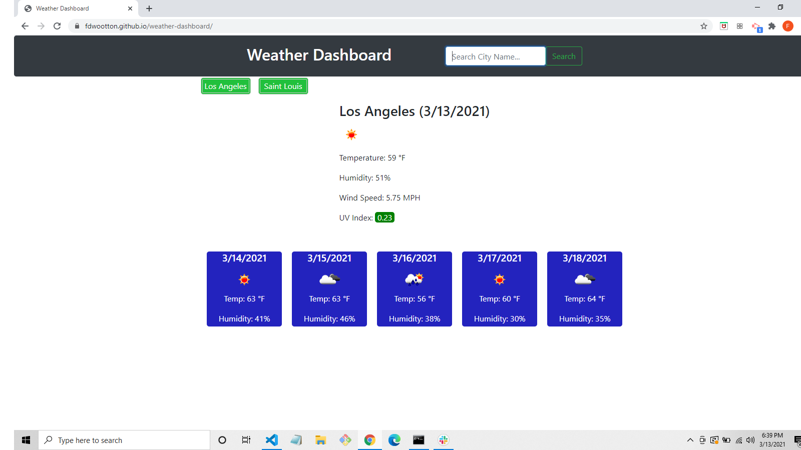

# Weather Dashboard

This application displays current weather conditions, along with a five-day forecast.  To operate, enter any city of your choice and click "search".  As a user, you will have access to several weather conditions, such as the temperature, humidity, wind speed, and UV-index.  The UV-index is conveniently color-coded (green, yellow, orange, red, or violet) based on severity.  The search history is saved and displayed on the page for easy access.  The For this project, I utilized two APIs (Current Weather API and One Call API) from Open Weather.  I also utilized Bootstrap, Moment.js, jQuery and local storage.

[Weather Dashboard](https://fdwootton.github.io/weather-dashboard/)

